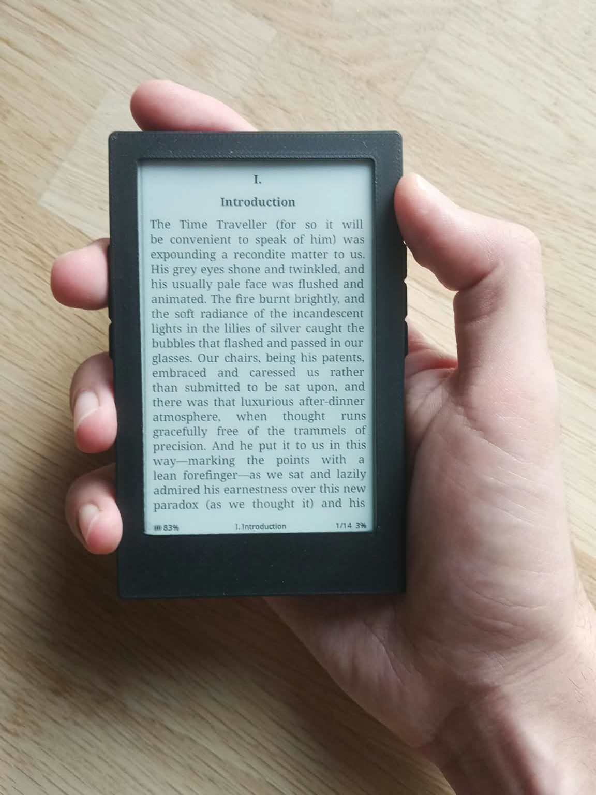
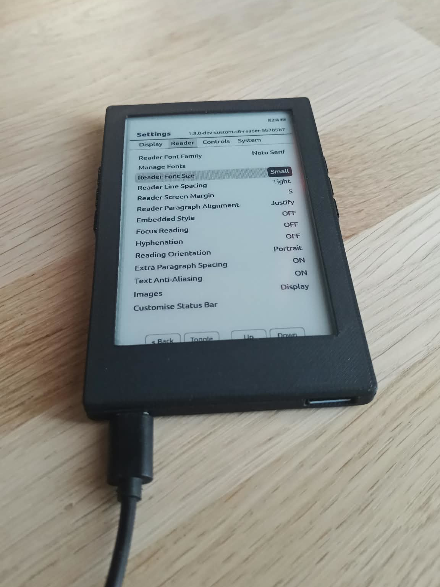
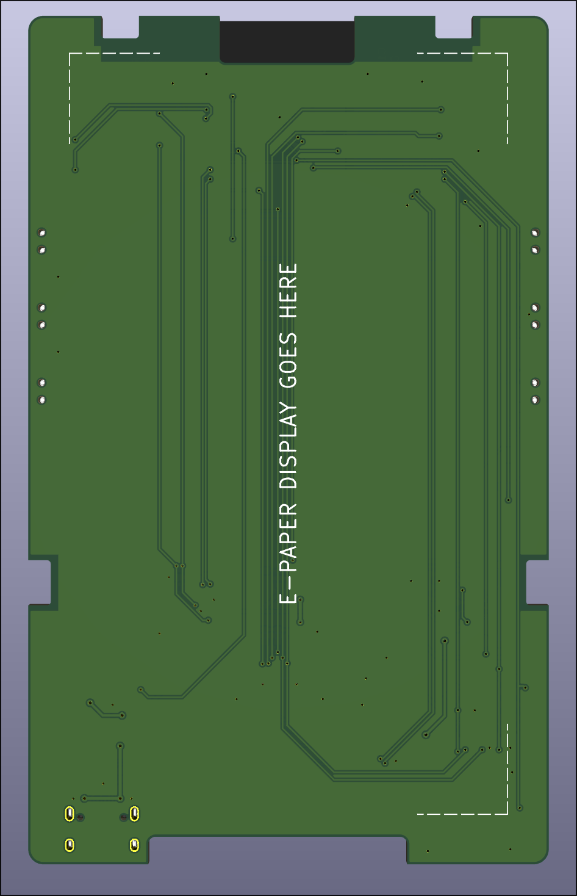
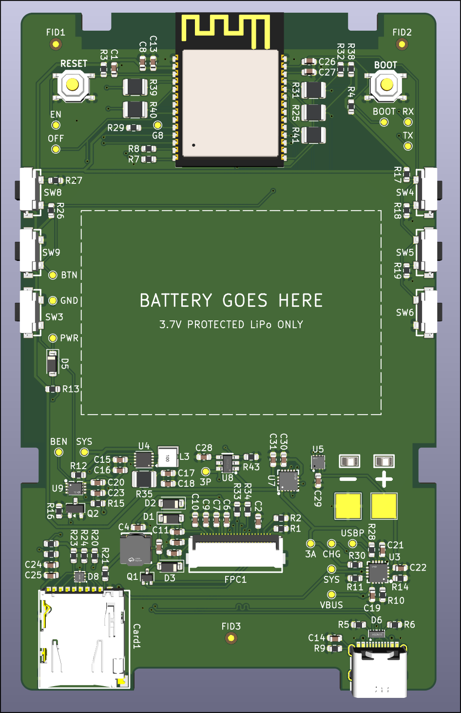

# E-Paper Reader

A small battery-powered e-paper reader built around a custom PCB.

  
  

The Xteink X4 was the starting point for this project. I liked the idea of a small reader with physical buttons, but wanted to design the electronics myself.

The board uses an ESP32-C6. I couldn't find any ESP32-C3 module with enough RAM for what I wanted, while the ESP32-S2 consumed too much power to my liking. The reader runs [my fork of CrossPoint Reader](https://github.com/mathias4833/crosspoint-reader).

## Hardware

Power comes from a single-cell Li-ion battery. A BQ24074 handles charging and power-path management, followed by a TPS63031 buck-boost converter for the 3.3 V rail. A MAX17048 fuel gauge estimates the battery's state of charge and reports it over I²C.

The rest of the board includes:

- a GoodDisplay GDEQ0426T82 e-paper panel;
- microSD storage;
- USB-C for charging and programming;
- six side buttons connected through two ADC resistor ladders;
- a LIS3DHTR three-axis accelerometer on the I²C bus;
- a switched supply for peripherals that do not need to remain powered.

## PCB

The schematic and PCB were designed in KiCad.

| Front | Back |
|---|---|
|  |  |

## Schematic

  

