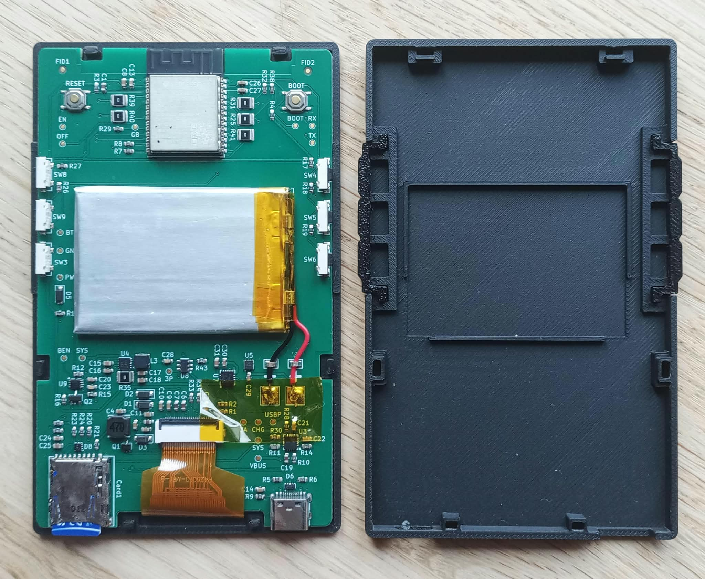

# E-Paper Reader

A small battery-powered e-paper reader built around a custom PCB.

  
  

*Quick demo of the UI and double-tap page turning:*

https://github.com/user-attachments/assets/651f01a9-5495-4bea-b6eb-84c9eb2a8fab

The Xteink X4 was the starting point for this project. I liked the idea of a small reader with physical buttons, but wanted to design the electronics myself.

The board uses an ESP32-C6 and runs [my fork of CrossPoint Reader](https://github.com/mathias4833/crosspoint-reader).

This is very much a V1. It works, but I already have several changes planned for V2.

## PCB

The schematic and PCB were designed in KiCad.

  

| Front | Back |
|---|---|
|  |  |

## Specifications

  |                     |                                                |
  |---------------------|------------------------------------------------|
  | MCU                 | ESP32-C6-WROOM-1-N8                            |
  | Memory              | 8 MB flash, 512 KB SRAM                        |
  | Display             | 4.26" Good Display GDEQ0426T82, 800 x 480      |
  | Storage             | microSD                                        |
  | Battery             | 600 mAh Li-Po                                  |
  | USB-C               | Of course :)                                   |
  | Charging controller | BQ24074                                        |
  | Voltage regulator   | TPS63031 3.3 V buck-boost                      |
  | Battery gauge       | MAX17048                                       |
  | Controls            | 6 physical side buttons                        |
  | Accelerometer       | LIS3DHTR, 3-axis                               |
  | PCB                 | 2 layers, 1.2 mm                               |
  | Dimensions          | Approx. 116 x 72 x 7.5 mm, including enclosure |

## Hardware

Power comes from a single-cell Li-ion battery. A BQ24074 handles charging and powers the reader from USB when plugged in. A TPS63031 generates the 3.3 V rail, and a MAX17048 keeps track of the battery level.

The display and microSD card share the SPI bus and are both on switchable power rails. The fuel gauge and accelerometer stay powered, since their idle current is low enough that there wasn't much to gain from switching them off (3uA and 0.5uA).

## Schematic

  

## Cost

In a batch of five, the parts and fabrication comes to roughly 60€ per reader.

| Part                         | Approx. cost per reader |
|------------------------------|------------------------:|
| PCB components               |                     20€ |
| PCB fabrication and assembly |                    ~15€ |
| 4.26" e-paper display        |                 ~17-19€ |
| 600 mAh battery              |                     ~8€ |
| 3D-printed enclosure         |                  ~0.50€ |
| **Total**                    |                **~60€** |

This is a rough estimate. Shipping and imports duties aren't included as they vary a lot depending on where you live, and you'll also need a microSD card and a soldering iron to attach the battery.

## Design decisions

### Layout

I wanted the reader to stay thin, so using through-hole parts was never really an option. I also wanted to avoid paying for assembly on both sides of the PCB (it's super expensive!), which meant keeping all components on the back. 
The buttons are thus on the sides. I used TPU for the button pieces in the enclosure, which makes them much nicer to press than rigid printed buttons.

I originally wanted the final assembly to be completely solderless. I looked for a low-profile battery connector on LCSC but couldn't find anything slim enough. Looking back, there were probably a few decent options I missed, but hey, it's the first version. In the end, I added two large solder pads and called it a day. The battery wires pass through two small metal loops first in order to provide strain relief before reaching the pads.
### ESP32-C6

Obviously my first choice was the ESP32-C3. It is what the Xteink X4 uses, and its power consumption is very good.

The problem was flash. Recent CrossPoint builds are a little over 6 MB, and the Xteink's 16 MB flash is split into two 6.25 MB application partitions so that OTA updates can keep both the old and new firmware around. That wasn't going to work with the C3 modules I could find, which were limited to 4MB flash.

The ESP32-S3 would have solved that, but it also consumes more power than I wanted for an ereader that spends most of its life asleep. 

I eventually found an ESP32-C6 module with 8 MB of flash. That's enough for CrossPoint, but not enough to keep two copies of the firmware around, so OTA updates had to go. USB flashing is good enough for me anyway.

### Power gating

I was using a cheap microSD card and didn't know how much current it would draw while idle. Since standby power matters a lot I didn't want to rely on the SD card behaving well.

So I added a switchable power rail for peripherals that don't need to stay on. When the reader goes to sleep, the firmware can cut their power completely instead of depending on their own low-power modes.
